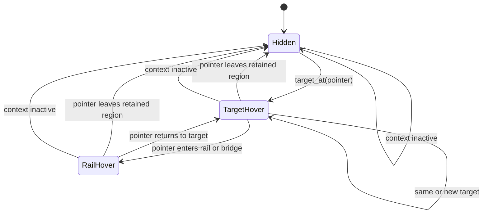
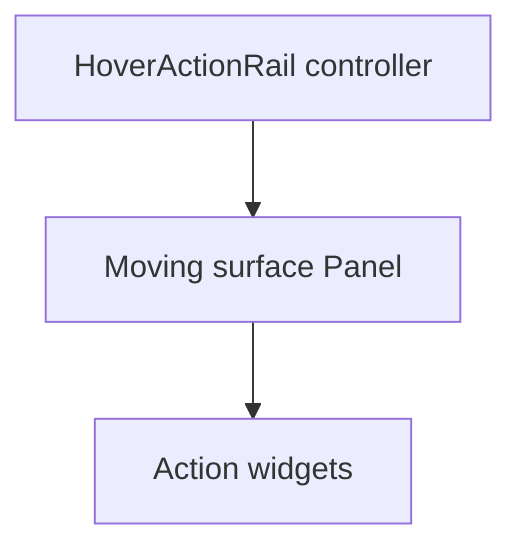

# Reusable hover action rail proposal

## Status

Proposed for DwarfUI.

The first consumer is the native Hauling route list, where the rail will expose
stop actions without covering the native scrollbar. The widget itself remains
independent of minecart routes, native Hauling state, and `AssetButton`.

## Problem

A native row can have useful contextual actions without having enough interior
space to render them. Permanently creating action widgets for every visible row
also creates visual clutter and duplicates widget state.

The existing minecart implementation places one action set beside every
visible stop row. Its right-side placement competes with the native scrollbar.
Moving those same permanent buttons elsewhere would solve the collision but
would not solve clutter or establish a reusable interaction contract.

## Decision

Add `dwarfui.HoverActionRail`, a transparent container that:

- resolves at most one hovered target;
- creates one stable set of generic action widgets;
- places those actions adjacent to the current target;
- renders a consumer-configured background and frame around those actions;
- retains the target while the pointer moves from the target into the rail;
- validates the target immediately before activation;
- consumes input only within its visible rail bounds; and
- clears all transient state when its host context becomes invalid.

For the Hauling menu, the rail will appear directly to the left of the native
panel. Its first action is nearest the panel and later actions grow leftward
over the map. Route headers do not produce a target.

## Goals

- Preserve a direct visual relationship between a target row and its actions.
- Require only one pointer movement and click to activate an action.
- Avoid covering native text, controls, borders, and scrollbars.
- Allow each consumer to configure the rail background, border, and inset.
- Support multiple action types without changing target-resolution code.
- Reuse arbitrary DFHack widgets, including `AssetButton`.
- Keep domain lookup and activation logic in the consumer.
- Remain safe when native rows scroll, reorder, disappear, or change identity.
- Make input ownership explicit and testable.

## Non-goals

- Discover native rows or panel bounds automatically.
- Modify native list layout or reserve native screen space.
- Define minecart action semantics.
- Provide a process-wide singleton.
- Replace ordinary context menus, tooltips, or fixed toolbars.
- Scale or crop graphics assets.

## Proposed module

```text
scripts_modinstalled/dwarfui/widgets/hover_action_rail.lua
```

The module exports three proper DFHack classes:

- `HoverActionTarget`: an immutable consumer-owned target snapshot.
- `HoverAction`: one action definition and widget factory.
- `HoverActionRail`: the rendered widget and interaction owner.

The supporting types are classes so their contracts can be validated at
construction and extended without relying on loosely shaped tables.

## Public types

### `HoverActionTarget`

```lua
---@class dwarfui.HoverActionTarget: dfhack.class
---@field key string|integer
---@field anchor {x1: integer, y1: integer, x2: integer, y2: integer}
---@field payload any
HoverActionTarget = defclass(HoverActionTarget)

---Validates stable identity and rail-local anchor bounds.
function HoverActionTarget:init()
end
```

`key` identifies the target across pointer samples. `anchor` is the current
target rectangle in rail-local coordinates. `payload` is opaque to the rail
and can contain consumer-specific IDs or snapshots.

The class does not claim that its payload remains current. The consumer's
validator is always authoritative.

### `HoverAction`

```lua
---@class dwarfui.HoverAction: dfhack.class
---@field id string
---@field widget_factory fun(activate: fun()): widgets.Widget
---@field activate fun(target: dwarfui.HoverActionTarget): boolean|nil
---@field visible fun(target: dwarfui.HoverActionTarget): boolean
---@field enabled fun(target: dwarfui.HoverActionTarget): boolean
---@field gap_after integer
HoverAction = defclass(HoverAction)

---Validates identity, factory, callbacks, and spacing.
function HoverAction:init()
end
```

The factory runs once per rail instance. Its callback is supplied by the rail,
so an action widget never captures a stale target. `visible` and `enabled` are
evaluated whenever the active target changes.

The action definition does not require `AssetButton`. A consumer may return an
asset button, text button, toggle, or another `widgets.Widget` that obeys normal
DFHack layout and input contracts.

### `HoverActionRail`

```lua
---@class dwarfui.HoverActionRail: widgets.Widget
---@field actions dwarfui.HoverAction[]
---@field target_at fun(x: integer, y: integer): dwarfui.HoverActionTarget|nil
---@field validate_target fun(target: dwarfui.HoverActionTarget): dwarfui.HoverActionTarget|nil
---@field context_active fun(): boolean
---@field mouse_provider fun(): integer|nil, integer|nil
---@field placement_bounds_provider fun(): table
---@field placement_order string[]
---@field action_gap integer
---@field consume_scroll boolean
---@field background_pen dfhack.pen|fun(target: dwarfui.HoverActionTarget): dfhack.pen|false
---@field border_style gui.Frame|fun(target: dwarfui.HoverActionTarget): gui.Frame|false
---@field content_inset integer|widgets.Widget.inset
---@field active_target dwarfui.HoverActionTarget|nil
---@field rail_bounds table|nil
---@field surface widgets.Panel
HoverActionRail = defclass(HoverActionRail, widgets.Widget)

---Creates each action widget once and initializes hidden rail state.
function HoverActionRail:init()
end

---Returns the currently retained target without validating it.
---@return dwarfui.HoverActionTarget|nil
function HoverActionRail:get_target()
end

---Samples context and pointer state, then updates target and placement.
function HoverActionRail:update_hover()
end

---Refreshes hover state before rendering the current action widgets.
---@param dc gui.Painter
function HoverActionRail:render(dc)
end

---Revalidates and activates one action against the current target.
---@param action dwarfui.HoverAction
---@return boolean activated
function HoverActionRail:activate(action)
end

---Clears the active target, geometry, and dynamic action state.
function HoverActionRail:clear()
end

---Consumes owned rail input while passing all other input through.
---@param keys table
---@return boolean
function HoverActionRail:onInput(keys)
end
```

Required callbacks have deliberately narrow responsibilities:

| Callback | Responsibility |
|---|---|
| `target_at(x, y)` | Map one current pointer position to a fresh target or `nil`. |
| `validate_target(target)` | Re-resolve target identity and return a fresh snapshot immediately before activation. |
| `context_active()` | Report whether the host screen, focus, and backing data are still valid. |
| `mouse_provider()` | Supply the screen pointer cell without requiring a global pointer hook. |
| `placement_bounds_provider()` | Supply the rail-local rectangle in which actions may be placed. |

The rail fills its parent and converts the screen pointer into rail-local
coordinates before calling `target_at`. Action frames and target anchors use
that same local coordinate space. This allows the widget to live in a
fullscreen overlay or another laid-out root without assuming that its parent
begins at screen coordinate `0,0`.

Presentation attributes apply only to the moving rail surface:

| Attribute | Contract |
|---|---|
| `background_pen` | A static pen, target-sensitive pen callback, or `false` for a transparent background. |
| `border_style` | A standard/custom `gui.Frame`, target-sensitive frame callback, or `false` for no border. |
| `content_inset` | Space reserved between the outer rail edge and its action widgets. |

The generic defaults are `background_pen=false`, `border_style=false`, and
`content_inset=0`. Consumers opt into presentation rather than inheriting an
unexpected opaque panel.

Standard DFHack styles such as `gui.FRAME_THIN`, `gui.FRAME_INTERIOR`, and
`gui.FRAME_INTERIOR_MEDIUM` are valid border values. A consumer can supply a
custom `gui.Frame` to control individual edge and corner glyphs and pens.

## Hover ownership

The rail distinguishes the source target from the action surface. Once a target
is active, the target remains retained while the pointer is:

- inside a freshly resolved target with the same key;
- inside the visible rail bounds; or
- inside the rectangular bridge between adjacent target and rail bounds.

The Hauling placement uses a zero-cell gap, so its bridge is empty. Bridge
support keeps the generic widget usable when another consumer requests spacing.



Changing directly from one target row to another rebinds the rail in the same
update. There is no leave timer and no frame-delayed target latch.

`update_hover()` runs at the beginning of both `render()` and `onInput()`.
Render-time updates keep presentation current without host wiring. Input-time
updates prevent a click from using geometry left over from the previous render.
The action callback still performs its own final validation after the rail has
accepted the input.

## Placement

The rail measures only currently visible action widgets, then expands that
content rectangle by `content_inset`. It tries each entry in `placement_order`
until the complete outer surface fits within the supplied placement bounds.

The border paints the outermost surface cells and does not add an implicit
inset. A conventional one-cell DFHack border should normally be paired with
`content_inset=1`. A zero inset is still allowed for a custom style intended to
share cells with its content.

Supported placements are:

- `left`: actions are vertically centered on the anchor and grow leftward;
- `right`: actions are vertically centered and grow rightward;
- `above`: the horizontal action sequence is centered above the anchor; and
- `below`: the horizontal action sequence is centered below the anchor.

With left placement, the first action is immediately left of the target and
later actions extend farther left. With right placement, the first action is
immediately right of the target and later actions extend farther right. This
keeps the primary action in a stable location as secondary actions are added.

Placement never clamps the rail across its target. If no candidate fits, the
rail remains hidden. A consumer that needs a fallback popout can include a
launcher action elsewhere; fallback presentation is not implicit rail behavior.

The Hauling consumer uses:

```lua
placement_order={'left'}
action_gap=0
```

Its target anchor is the full three-row native stop entry, excluding the native
scrollbar column. The outer rail surface ends immediately before the panel's
left edge. The three-row zoom graphic remains vertically centered on its stop;
a configured border or inset may extend the surface above and below that row.

## Rendering

`HoverActionRail` is a transparent, full-parent controller. It owns one
internal `widgets.Panel` named `surface`. The surface is the only moving and
painted element:



The surface receives the resolved `background_pen` as its
`frame_background`, the resolved `border_style` as its `frame_style`, and
`content_inset` as its `frame_inset`. Action widgets are children of the
surface and use body-relative coordinates.

Background painting occurs before border and action rendering. A transparent
background leaves the underlying map visible. An opaque background isolates
the action graphics from visually noisy map tiles. Consumers can also provide
a `keep_lower=true` background pen when they want composited presentation.

The complete outer surface, including border cells, defines `rail_bounds`.
This same rectangle controls placement fitting, hover retention, and input
ownership.

The rail renders as the last subview of its host overlay so action graphics
remain above the native screen and map markers. Transparent action pens may use
`keep_lower=true` to preserve the underlying map.

Only one action-widget set exists. Target changes update child action frames
and dynamic widget state instead of constructing or destroying widgets.

## Input contract

- Merely hovering a target never consumes native input.
- Native target-row clicks continue to pass through unchanged.
- An action widget consumes its own activation click.
- Mouse clicks on the visible background, border, inset, or action gaps are
  consumed so they cannot reach the map underneath.
- Scroll-wheel input over the rail is consumed by default, preventing
  accidental map or z-level movement.
- Scroll-wheel input over the native list remains native and causes the rail
  to move or rebind on its next update.
- Keyboard input and pointer input outside the rail pass through unchanged.
- Disabled actions remain visible but cannot consume activation input.
- A hidden rail owns no input.

The generic widget does not synthesize native scrolling. Consumers that want
wheel input over the rail to scroll a backing list can add an explicit scroll
callback in a later compatible extension.

## Freshness and stale-target safety

Pointer hover establishes presentation, not activation authority.

Before invoking an action, the rail calls `validate_target(active_target)`.
Activation proceeds only when validation returns a target with the same key.
The fresh target replaces the retained snapshot and is passed to the action.

For the Hauling adapter, validation must compare:

- current focus;
- cached menu bounds;
- current `scroll_position`;
- flattened `view_routes[row_index]`;
- flattened `view_stops[row_index]`;
- route ID;
- stop ID; and
- the row's current screen anchor.

If any comparison fails, the rail clears and consumes the attempted button
click without selecting a route or moving the map. A button can therefore
never act on the stop that previously occupied its screen row.

## Hauling integration

The minecart overlay supplies a thin adapter:

```lua
---@return dwarfui.HoverActionTarget|nil
local function target_at_pointer(x, y)
    -- Resolve only real stop rows from current native flattened state.
end

---@return dwarfui.HoverActionTarget|nil
local function validate_stop_target(target)
    -- Re-read native focus, scroll, row identity, position, and anchor.
end

local rail = HoverActionRail{
    actions={
        HoverAction{
            id='recenter',
            widget_factory=function(activate)
                return AssetButton{
                    asset={page='INTERFACE_BITS', x=32, y=0},
                    chars=STOCKS_RECENTER_CHARS,
                    pens=STOCKS_RECENTER_PENS,
                    on_activate=activate,
                }
            end,
            activate=function(target)
                return zoom_and_select_route(target.payload)
            end,
        },
    },
    target_at=target_at_pointer,
    validate_target=validate_stop_target,
    context_active=is_hauling_open,
    placement_order={'left'},
    background_pen=dfhack.pen.parse{
        ch=32,
        fg=COLOR_BLACK,
        bg=COLOR_BLACK,
    },
    border_style=gui.FRAME_INTERIOR,
    content_inset=1,
}
```

The adapter owns all route and stop semantics. `HoverActionRail` never imports
the minecart model.

The existing per-visible-row `MinecartStopActionPool` is no longer necessary
for presentation. The current action definitions can either be adapted into
`HoverAction` instances or replaced by the generic definition class. The
minecart-specific target validation remains in the overlay.

## Lifecycle

The rail clears immediately when:

- its host focus is no longer supported;
- the native panel or backing data disappears;
- the overlay is disabled;
- the active target fails validation during an update;
- the pointer leaves the retained target/rail region; or
- the world unloads.

Clearing hides every action widget and removes its active target reference.
The rail does not own a screen, global hook, timeout, or process-wide registry,
so ordinary overlay destruction is sufficient cleanup.

Reload creates a new rail with a new action-widget set. No callback captures an
old target because widget callbacks delegate through their owning rail.

## Verification contract

### Generic unit coverage

- Constructs each action widget exactly once.
- Rejects duplicate action IDs and invalid callback contracts.
- Accepts transparent, opaque, and target-sensitive backgrounds.
- Accepts no border, standard DFHack borders, and custom frame definitions.
- Includes border and inset cells in measured placement geometry.
- Renders background, border, and actions in deterministic layer order.
- Remains hidden when no target is under the pointer.
- Places the first action nearest the target for every supported placement.
- Grows additional actions away from the target.
- Rejects placements that do not fit the placement bounds.
- Rebinds immediately when the pointer crosses directly between targets.
- Retains one target while the pointer moves from target to rail.
- Clears when the pointer leaves target, bridge, and rail.
- Validates immediately before activation.
- Rejects a stale target without invoking its action.
- Updates dynamic visibility and enabled state after target changes.
- Consumes action clicks, rail-gap clicks, and configured scroll input.
- Passes target-row and unrelated input through.
- Clears all transient state when context becomes inactive.

### Hauling component coverage

- Opens the native Hauling menu itself.
- Reads real cached panel bounds and flattened native row state.
- Positions the rail entirely left of the native panel and scrollbar.
- Renders the configured rail background and border around the action content.
- Produces no rail for route-header rows.
- Produces one rail for the hovered real stop row.
- Keeps the rail visible while the pointer moves onto its zoom action.
- Reads all nine production graphics cells.
- Clicks through the mounted production rail and `AssetButton`.
- Selects the action target's owning route.
- Renders the selection indicator on the corresponding route header.
- Centers and highlights the current stop.
- Scrolls the native list with the pointer over the native list.
- Rebinds or hides the rail after native scrolling.
- Rejects a click if the previously hovered stop is no longer current.
- Restores pointer, viewport, highlight, selection, scroll, and screen state.
- Receives confirmed DwarfSpec cleanup.

## Rejected alternatives

| Alternative | Reason |
|---|---|
| Permanent left-side buttons for every stop | Avoids the scrollbar but retains visual clutter and per-row widget duplication. |
| Inline hover replacement | Temporarily obscures native stop names and leaves little room for additional actions. |
| Fixed header toolbar | Requires a separate stop-selection interaction before activation. |
| Right-side placement | Continues to compete with the native scrollbar. |
| Modifier click or double-click only | Uses no space but is difficult to discover and does not support multiple visible actions. |
| Implicit popout fallback | Makes placement behavior surprising and couples a small widget to a second presentation system. |

## Recommendation

Implement `HoverActionTarget`, `HoverAction`, and `HoverActionRail` in the
generic widget module, then migrate the minecart zoom action to one left-side
rail owned by the registered route overlay.

The first integration should keep `placement_order={'left'}` and hide the rail
when it cannot fit. A separate explicit popout can be added later if live
layouts demonstrate a real need for fallback presentation.
